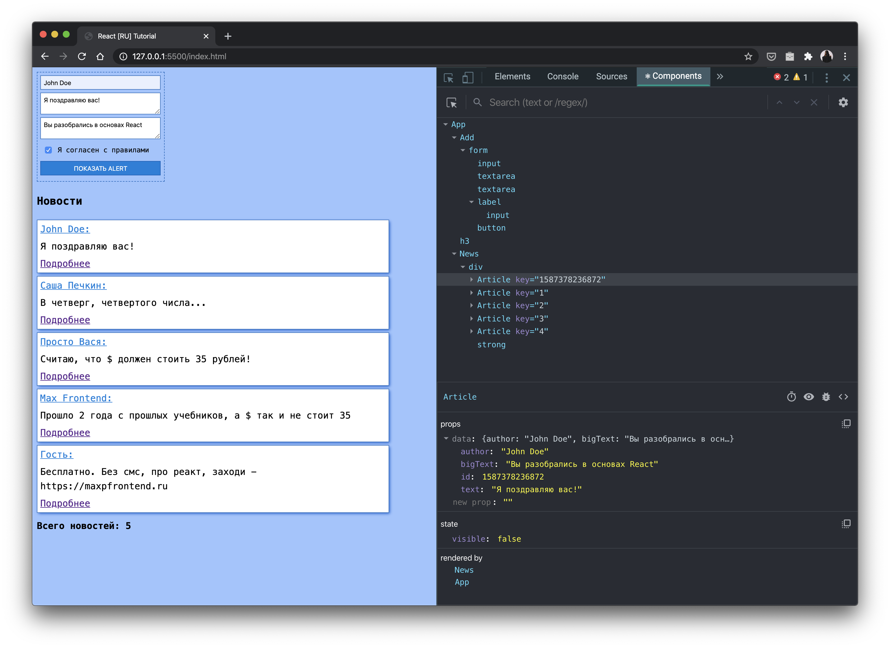

# React.js для начинающих

### В данном курсе разбираются основы React.js

Результатом курса будет небольшое **приложение новостей**, в котором можно *добавить новость*, *а так же посмотреть у новости "подробнее"*.

_После курса, вы научитесь:_

1. Создавать компоненты, учитывая `propTypes`
1. Грамотно использовать `props` и `state` компонента 
1. Работать с формой
1. Работать с `React DevTools`
1. Рефакторить и быть лучше ;-)